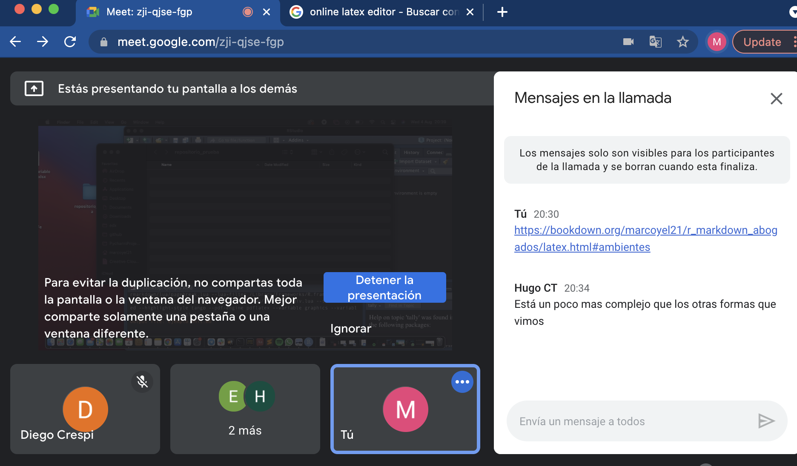

% texto fuente tamaño 10, mas margen, y cursivas    
\newenvironment{enunciado}
{
    \itshape
    \leftskip=1cm \rightskip=1cm
    \begingroup
    \fontsize{10}{10}\selectfont
    }
    {
    \endgroup
    \leftskip=0cm\rightskip=0cm
}
\begin{enunciado}
Este es un texto de ejemplo, arriba de la imagen.
\end{enunciado}

Agregamos un parrafo de contestación de demanda
